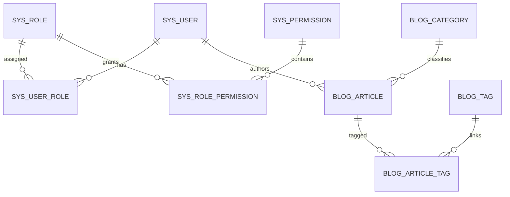

# Yufeichi Platform V1.0 数据库与迁移说明

更新日期：2026-09-29

## 数据库基线

V1.0 使用 MySQL 8.4 和 Flyway。V1～V9 历史迁移保持不可修改，V10 用于禁用固定种子管理员并配合一次性离线 bootstrap。

迁移文件：

- V1 `init_rbac_tables`
- V2 `insert_default_admin`
- V3 `add_article_tables`
- V4 `add_project_tables`
- V5 `add_message_tables`
- V6 `add_comment_tables`
- V7 `add_file_tables`
- V8 `add_log_tables`
- V9 `add_system_config`
- V10 `disable_seed_and_bootstrap`

Day7 最终验证证明：空测试库可以从 V1 连续迁移到 V10；正式生产备份也可以恢复到独立 MySQL 8.4.11 容器。

## 核心关系

留言、评论、日志和系统配置等历史表继续保留，但不是 V1.0 当前公开站点的核心管理页面。

## 一致性规则

- 用户角色、角色权限、文章标签等多表写入必须事务化。
- 文章 authorId 从认证主体取得，不接受客户端随意指定。
- 草稿、下架、删除文章不能公开读取；隐藏项目不能公开读取。
- 分类/标签仍被文章引用时拒绝删除。
- 逻辑删除不会自动释放 name、slug、username 等唯一值。
- 列表接口分页，避免直接返回整篇 LONGTEXT。
- 客户端排序字段不直接拼入 SQL。

## Flyway 规则

- 已执行的 V1～V10 不得重写、改名或重新编号。
- 新 schema 变化从 V11 继续增加。
- 不使用 clean、repair 或 baseline 掩盖 checksum 异常。
- 代码 release 回滚不会自动回滚数据库。
- 新迁移应尽量与上一兼容代码版本共存。

Day7 已实测 `31a551c` 在 V10 schema 上正常启动，随后恢复当前 release，数据库始终保持 V10。

## 正式备份

服务器：`/var/backups/yufeichi/day7-20260929T102727Z`

Windows 异机副本：`D:\Desktop\yufeichi-backups\day7-20260929T102727Z.tar.gz`

SHA-256：`d90c6d05a7fe82b73e5145d98018215b1e33b490447ebca4f60232e6c9bd1dcb`

备份包含 `database.sql.gz`、`uploads.tar.gz`、`manifest.txt`、`flyway.txt` 和 `SHA256SUMS`。

## 独立恢复结果

- schema 表数量：18
- Flyway V1～V10：PASS
- 文章记录：2
- 文件记录：2
- 用户记录：2
- uploads 文件：2
- uploads 相对路径与逐文件 SHA-256：PASS

恢复使用独立临时 MySQL 容器和临时 uploads 目录，没有覆盖在线生产数据。
